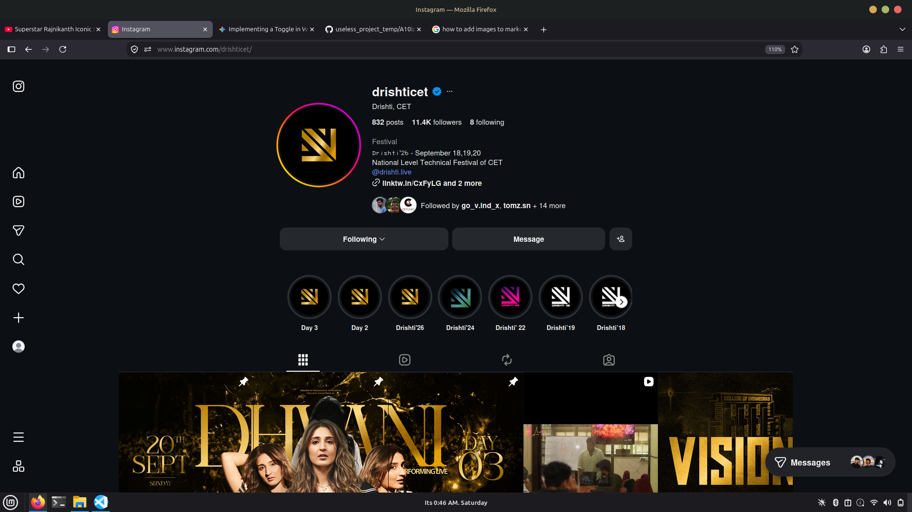
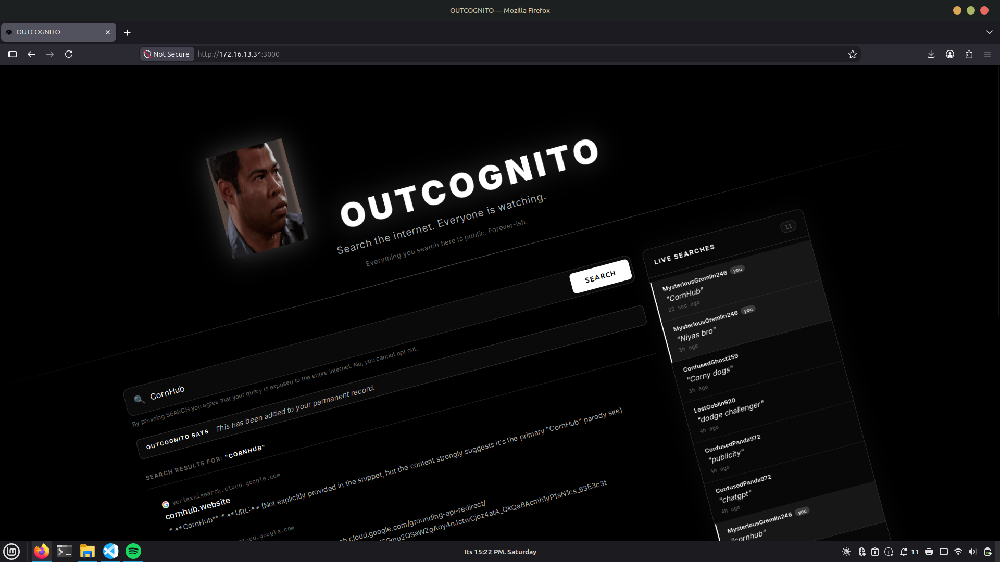

# A10izer 🎯

## Basic Details
### Team Name: FourZeroFour

### Team Members
- Team Lead: Sreekumar Sajith - CET, Tvm
- Member 2: Adithya Uday - CET, TVM

### Project Description
Gives a classic Lalettan Signature move to every website you are visiting

### The Problem (that doesn't exist)
Lalettans legacy is slowly fading in the internet.

### The Solution (that nobody asked for)
With A10izer, we remind our users A10 and his classic signature move how a left shoulder slant carried the whole malayalam film industries.

## Technical Details
### Technologies/Components Used
For Software:
- Javascript, HTML, CSS
- Manifest V3
- None
- VS Code, Firefox

### Implementation
For Software:
# Installation
git clone https://github.com/sarksnr/useless_project_temp/tree/main/A10izer
go to about:debugging in firefox and load temporary addon, then select manifest.json

# Run
no particular commands

### Project Documentation
For Software:

# Screenshots 

*Normal Page*

*A10izing the page*

*Add caption explaining what this shows*

# Diagrams

*Add caption explaining your workflow*

### Project Demo
# Video
[Add your demo video link here]
*Explain what the video demonstrates*

## Team Contributions
- Sreekumar Sajith: Made this alone

---
Made with ❤️ at TinkerHub Useless Projects 

